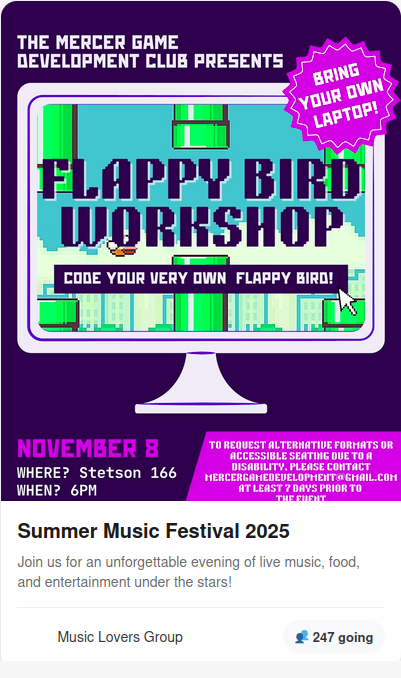
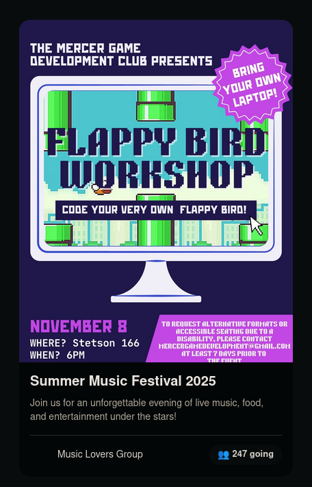
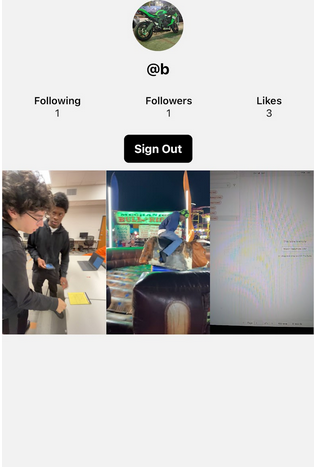
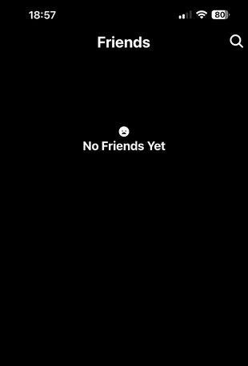
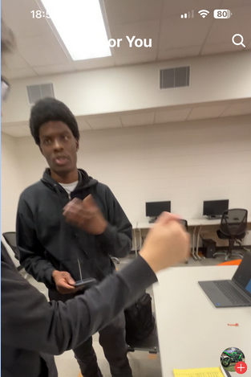
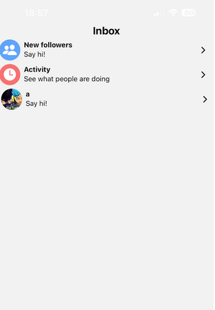

# Semester Summary

# 📘 Semester Project Summary  
*A look at the evolution of our Community Event Finder app*

---

## ⭐ Version One — Initial Prototype  
Our journey began with **Community Event Finder**, the earliest version of our application. At this stage, our focus was almost entirely on building out the **visual identity** of the project.

We experimented with **card-based UI components**, exploring color palettes, layout spacing, and general branding. Although simple, this version helped us understand what type of interface would best support an event-focused application.

### 📸 Early Design Mockups  
  

---

## ⭐ Version Two — TikTok-Inspired Redesign  
The second version was presented to **Dr. Allen**, incorporating a modern, scroll-based UI inspired by **TikTok's vertical feed**.  
This design allowed events to be consumed quickly and visually, but it was still missing a key component: **a working backend**.

While this version made major strides in user engagement and visual flow, its limitations highlighted the need for real data and a scalable architecture.

---

## ⭐ Version Three — Final Production Version  
For the final iteration of our app, we combined the visual lessons from earlier versions with solid engineering foundations.

### 🚀 What Improved in Version Three?
- A more polished and responsive **frontend**  
- Smoother navigation and cleaner event layouts  
- A fully integrated **Supabase backend** for authentication and data storage  
- Real event entries stored, retrieved, and displayed dynamically  
- A design that feels more like a complete, ready-to-use product

This version represents the culmination of our semester-long progress and reflects a strong balance between **user experience, functionality, and modern web development practices**.

### 📸 Early Design Mockups  
  
  
  
  

---

# Meeting Notes 

