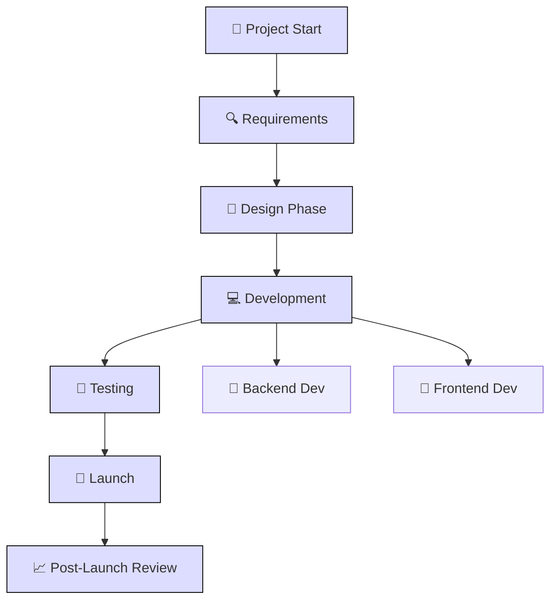

```mermaid

flowchart TD
    %% Title
    A[📅 Project Start] --> B[🔍 Requirements]
    B --> C[🎨 Design Phase]
    C --> D[💻 Development]
    D --> E[🧪 Testing]
    E --> F[🚀 Launch]
    F --> G[📈 Post-Launch Review]

    %% Optional loops or parallel steps
    D --> D1[🔧 Backend Dev]
    D --> D2[🎨 Frontend Dev]

    %% Decorative style (optional class styling below)
    classDef milestone fill:#DDF,stroke:#000,stroke-width:1px,color:#333;
    class A,B,C,D,E,F,G milestone;


```